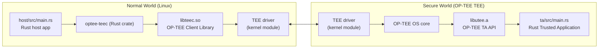

# stm32-tee

A Rust-based Trusted Application and host application for the STM32MP2 platform, communicating through OP-TEE's secure world boundary. The TA runs in the TEE (Secure World) and the host application runs in Normal World Linux.

## Quick Start

The full build, deploy, and run workflow is documented in [QUICKSTART.md](QUICKSTART.md). The essential steps are:

```bash
# Source the SDK environment
source .envrc

# Clone the TrustZone SDK
cd crates && git clone https://github.com/apache/teaclave-trustzone-sdk.git trustzone-sdk && cd ..

# Build both components
make ta host

# Deploy to the board (replace with your board's address)
make deploy BOARD_ADDRESS=<board-address>
```

See QUICKSTART.md for detailed instructions, signing key configuration, and runtime verification.

## Prerequisites

- **STM32MP2 board** with OP-TEE OS installed and reachable via SSH (e.g. `ssh root@<board-address>`)
- **Yocto SDK** extracted to `/opt/sdk/` — the STM32MP2 OpenSTLinux SDK containing the `aarch64-ostl-linux-` cross-compiler toolchain
- **Rust toolchain** — `rustup` must be available on `PATH`; the project pins a stable channel via `rust-toolchain.toml`
- **Apache Teaclave TrustZone SDK** — cloned into `crates/trustzone-sdk/`
- **`dprint`** installed — used for TOML, JSON, and Markdown formatting (enforced by `make lint`)

All cross-compilation environment variables (`CROSS_COMPILE`, `OECORE_TARGET_SYSROOT`, `TA_DEV_KIT_DIR`, `OPTEE_CLIENT_EXPORT`) are set by sourcing `.envrc`, which in turn sources the Yocto SDK's `environment-setup` script.

## Architecture

The project implements a two-world boundary. The host application runs in Normal World (Linux) and communicates with the Trusted Application in Secure World (OP-TEE TEE) through the OP-TEE Client API.



Key points:

- The **host app** calls into `optee-teec`, which is a Rust wrapper around `libteec.so` (the OP-TEE client library).
- `libteec.so` communicates with the kernel's TEE driver, which triggers a secure monitor call to enter the **secure world**.
- In the **TA**, `optee-utee` provides Rust bindings to the `libutee.a` TA library, which links against OP-TEE OS core services (tracing, session management, parameters).
- The TA is `no_std` and cannot make any normal-world syscalls. The host is a standard Linux binary.

## Build Artifacts

Each subdirectory (`ta/` and `host/`) manages its own build output independently under `target/aarch64-unknown-linux-gnu/release/`. The key artifacts are:

### Trusted Application (ta/)

| Artifact                                 | Description                                                                                                                            |
| ---------------------------------------- | -------------------------------------------------------------------------------------------------------------------------------------- |
| `target/<target>/release/<uuid>.ta`      | **Final signed TA binary** — deployed to the board. Produced by stripping and signing the raw ELF via `objcopy` and `sign_encrypt.py`. |
| `target/<target>/release/hello_world_ta` | Unstripped ELF binary (debug symbols still present).                                                                                   |
| `target/<target>/release/stripped_ta`    | Stripped binary (debug symbols removed), intermediate step before signing.                                                             |
| `target/<target>/release/`               | Directory containing all TA build artifacts. Git-ignored.                                                                              |

### Host Application (host/)

| Artifact                                   | Description                                                                                             |
| ------------------------------------------ | ------------------------------------------------------------------------------------------------------- |
| `target/<target>/release/hello_world_host` | **Final host binary** — deployed to the board. A cross-compiled ARM64 ELF linking against `libteec.so`. |
| `target/<target>/release/`                 | Directory containing all host build artifacts. Git-ignored.                                             |

The root Makefile delegates all build, format, and lint targets to the sub-Makefiles. Sub-Makefiles can be invoked standalone (e.g. `make -C ta ta`) — they each define a `TARGET ?=` fallback so the parent's variables are optional.

A linker wrapper (`cargo-linker-wrapper.sh`) injects `--sysroot` into every linker invocation, allowing Cargo to locate C runtime startup files (`Scrt1.o`, `crti.o`, etc.) inside the Yocto sysroot during cross-linking.

## Configuration

All configuration is driven by environment variables or Makefile defaults. The following table lists the variables that most directly affect the build:

| Variable                | Default                                      | Description                                                                            |
| ----------------------- | -------------------------------------------- | -------------------------------------------------------------------------------------- |
| `TARGET`                | `aarch64-unknown-linux-gnu`                  | Rust target triple for cross-compilation.                                              |
| `CROSS_COMPILE`         | `aarch64-ostl-linux-`                        | Prefix for the Yocto cross-compiler toolchain (gcc, ar, objcopy, etc.).                |
| `OECORE_TARGET_SYSROOT` | `/opt/sdk/sysroots/cortexa35-ostl-linux`     | Target sysroot path used by `cargo-linker-wrapper.sh`.                                 |
| `TA_DEV_KIT_DIR`        | `/opt/sdk/sysroots/.../export-user_ta_arm64` | OP-TEE TA development kit — contains headers, `sign_encrypt.py`, and `default_ta.pem`. |
| `OPTEE_CLIENT_EXPORT`   | `/opt/sdk/sysroots/cortexa35-ostl-linux`     | OP-TEE client SDK path — provides `libteec.so` and headers for host builds.            |
| `TA_SIGN_KEY`           | `$(TA_DEV_KIT_DIR)/keys/default_ta.pem`      | Path to the RSA private key used to sign the TA binary.                                |
| `TA_SIGN_SCRIPT`        | `$(TA_DEV_KIT_DIR)/scripts/sign_encrypt.py`  | Signing script shipped with the TA dev kit.                                            |
| `BOARD_ADDRESS`         | _(unset)_                                    | SSH address of the STM32MP2 board, required by `make deploy`.                          |

Override any variable by passing it on the `make` command line (e.g. `make ta TA_SIGN_KEY=/path/to/key.pem`) or by exporting it in your shell.

The default test key (`default_ta.pem`) is sufficient for development on a board that was provisioned with the SDK's default key. Production boards require a board-specific key — see QUICKSTART.md for key generation and deployment.

## Typical Workflow

This section describes the full workflow from setup to deployment.

### 1. Environment Setup

Source the SDK environment, which configures all cross-compilation variables:

```bash
source .envrc
```

This sources `/opt/sdk/environment-setup`, exporting `CROSS_COMPILE`, `OECORE_TARGET_SYSROOT`, `TA_DEV_KIT_DIR`, `OPTEE_CLIENT_EXPORT`, and other variables needed by the build system. A copy of the default board address is also exported for convenience (override with `BOARD_ADDRESS` on the command line or in your shell).

### 2. SDK Download

The board's Yocto SDK must be downloaded from the [ST Microelectronics website](https://www.st.com/en/development-tools/stm32mp2.html) and extracted to `/opt/sdk/`. The SDK provides the cross-compilation toolchain, sysroots, and OP-TEE development headers required by both the TA and host builds.

The devcontainer assumes the SDK tarball (e.g. `SDK-x86_64-stm32mp2-openstlinux-*.tar.gz`) sits in the repository trunk. The Dockerfile copies it into the container so the SDK setup runs at build time. If your SDK tarball has a different name, update the `Dockerfile` accordingly.

### 3. Clone the TrustZone SDK

Pull the Apache Teaclave TrustZone SDK, which provides the Rust bindings for OP-TEE:

```bash
cd crates
git clone https://github.com/apache/teaclave-trustzone-sdk.git trustzone-sdk
cd ..
```

> **Note:** The SDK crates are pinned to OP-TEE 4.10.0. Verify that your STM32MP2 SDK ships the matching OP-TEE version.

### 4. Build

Build the TA and host in a single command, or invoke them individually:

```bash
# Build both (TA first, then host)
make

# Or individually:
make ta       # Builds, strips, and signs the TA binary
make host     # Builds the host application
```

The TA build (`make ta`) produces a signed `.ta` binary suitable for deployment. See [QUICKSTART.md](QUICKSTART.md) for details on TA signing and RSA key configuration.

### 5. Deploy

Copy the built binaries to the board:

```bash
make deploy BOARD_ADDRESS=<board-address>
```

This SCPs the signed TA binary to `/usr/lib/tee-datasync/` on the board and the host app to `/root/`.

### 6. Run

SSH into the board and run the host application:

```bash
ssh root@<board-address> ./hello_world_host
```

Expected output:

```text
Sending value to TA: 42
TA echoed (incremented) value to 43
TA decreased value back to 42
Done
```

You should also see the TA's log output in the secure log:

```bash
# On the board
journalctl -k | grep optee
# or
dmesg | grep optee
```

### 7. Lint and Format

Before committing, run the lint and format checks:

```bash
make format   # Formats all source files (TOML, JSON, Markdown) via dprint
make lint     # Runs clippy, fmt-check, and dprint-check on both TA and host
```

### 8. Clean

Remove all build artifacts:

```bash
make clean
```

## Known Constraints

- **OP-TEE version compatibility** — The TrustZone SDK crates in this project target OP-TEE 4.10.0. The OP-TEE bindings are ABI-sensitive; a mismatch between the SDK version and the OP-TEE version running on the board will cause runtime failures or silent corruption. Verify the board ships OP-TEE 4.10.0 before building.

- **no_std TA** — The Trusted Application is compiled with `#![no_std]` and `#![no_main]`. It does not link against `std` or libc and cannot make normal-world syscalls. The `std` feature on the TA crate exists but requires a nightly toolchain and `-Z build-std` to activate — only enable it if the board's OP-TEE was built with the matching feature.

- **Cross-compilation only** — Both the TA and host are cross-compiled for `aarch64-unknown-linux-gnu`. Running `cargo build` without the target triple will produce binaries for the host architecture, which are useless on the STM32MP2 board. The `cargo-linker-wrapper.sh` script is required during linking to resolve the sysroot for C runtime objects.

- **RSA signing only** — OP-TEE's TA signature mechanism accepts RSA-PSS (SHA-256) keys. ECDSA keys are not supported by the signing flow (`sign_encrypt.py`). The default SDK key is a 2048-bit RSA key; production deployments must use a board-specific key provisioned into the OP-TEE core.

- **Linker driver** — The TA is linked through the cross-compiler driver (`cc` / `gcc-ld`), not directly through `rust-lld`. This means the `--dynamic-list` file (referenced by `build.rs`) must reside in the Cargo manifest directory, not just in `OUT_DIR`, because `rust-lld` resolves relative paths against the working directory where `make` was invoked.

## Further Reading

- [QUICKSTART.md](QUICKSTART.md) — step-by-step build, deploy, and run instructions
- [Apache Teaclave TrustZone SDK](https://github.com/apache/teaclave-trustzone-sdk) — the upstream project containing the Rust `optee-utee` and `optee-teec` crates, along with 20+ TA/CA reference examples
- [OP-TEE Documentation](https://optee.readthedocs.io) — official OP-TEE reference covering secure world architecture, client API, and TA development
