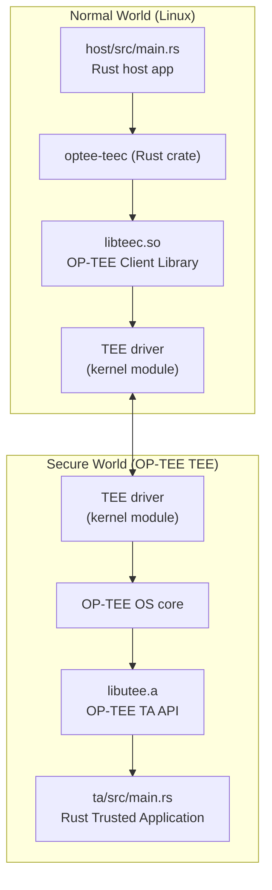

# STM32MP2 OP-TEE development environment template

A Rust-based Trusted Application and host application for the STM32MP2 platform, communicating through OP-TEE's secure world boundary. The TA runs in the TEE (Secure World) and the host application runs in Normal World Linux.

## Quick Start

The full build, deploy, and run workflow is documented in [QUICKSTART.md](QUICKSTART.md). The essential steps are:

```bash
# Bootstrap environment from the example file (not tracked in git).
cp .envrc.example .envrc

# direnv automatically sources .envrc when you enter the workspace directory (accept the prompt with `direnv allow`).
# TrustZone SDK pulled automatically via git dependencies (tag v0.9.0) — no action needed. See Known Constraints below for version details.

# Initialize the TA UUID before building.
make init

# Build both components (or use `make` alone, which invokes the default target that builds both)
make ta host

# Deploy to the board (replace with your board's address)
make deploy BOARD_ADDRESS=<board-address>
```

See QUICKSTART.md for detailed instructions, signing key configuration, and runtime verification.

## Prerequisites

- **STM32MP2 board** with OP-TEE OS installed and reachable via SSH (e.g. `ssh root@<board-address>`)
- **Yocto SDK** — the STM32MP2 OpenSTLinux SDK (with optional Rust add-ons) containing the `aarch64-ostl-linux-` cross-compiler toolchain. The SDK tarballs (`SDK-x86_64-stm32mp2-openstlinux-6.6-yocto-scarthgap-mpu-v26.06.10.tar.gz` and `SDK-x86_64-stm32mp2-openstlinux-6.6-v26.06.10-addon-rust.tar.gz`) are necessary and can be configured via the `SDK_TARBALL_FILE` and `SDK_RUST_ADDON_FILE` variables in `.devcontainer/devcontainer.json`. Download them from the [STM32MP2 Getting Started page](https://wiki.st.com/stm32mpu/wiki/Getting_started/STM32MP2_boards/STM32MP257x-DK/Develop_on_Arm_Cortex-A35/Install_the_SDK).
- **Rust toolchain** — `rustup` must be available on `PATH`; the project uses nightly for the TA (`ta/rust-toolchain.toml`) and stable for the host (`host/rust-toolchain.toml`)
- **Apache Teaclave TrustZone SDK** — pulled automatically via git dependencies in `ta/Cargo.toml` and `host/Cargo.toml` (tag `v0.9.0`)
- **`dprint`** installed — used for TOML, JSON, and Markdown formatting (enforced by `make lint`)

All cross-compilation environment variables (`CROSS_COMPILE`, `OECORE_TARGET_SYSROOT`, `TA_DEV_KIT_DIR`, `OPTEE_CLIENT_EXPORT`) are managed by [direnv](https://direnv.net/) — copy `.envrc.example` to `.envrc` and run `direnv allow` so that entering the workspace directory automatically sources the required variables.

## Architecture

The project implements a two-world boundary. The host application runs in Normal World (Linux) and communicates with the Trusted Application in Secure World (OP-TEE TEE) through the OP-TEE Client API.



Key points:

- The **host app** calls into `optee-teec`, which is a Rust wrapper around `libteec.so` (the OP-TEE client library).
- `libteec.so` communicates with the kernel's TEE driver, which triggers a secure monitor call to enter the **secure world**.
- In the **TA**, `optee-utee` provides Rust bindings to the `libutee.a` TA library, which links against OP-TEE OS core services (tracing, session management, parameters).
- The TA is `no_std` (unless the `std` feature is enabled via nightly) and cannot make any normal-world syscalls by default. The host is a standard Linux binary.

The build process places the signed TA binary at `ta/target/aarch64-unknown-linux-gnu/release/<uuid>.ta` and the host binary at `host/target/aarch64-unknown-linux-gnu/release/hello-world-host`.

The root Makefile delegates all build, format, and lint targets to the sub-Makefiles. Standalone invocation (e.g. `make -C ta`) requires `CROSS_COMPILE`, `TA_SIGN_KEY`, and `TA_SIGN_SCRIPT` to be set, or you must export them in your shell before running `make`.

Cross-compilation is configured via `.cargo/config.toml` in both `ta/` and `host/`. The linker is set to `aarch64-ostl-linux-gcc` (Yocto's cross-compiler) and the sysroot is injected via a `-C link-arg=--sysroot=/opt/sdk/sysroots/cortexa35-ostl-linux` rustflag. Note that this path is hardcoded in `.cargo/config.toml`; users with non-default SDK paths must update it there.

## Configuration

All configuration is driven by environment variables or Makefile defaults. The following table lists the variables that most directly affect the build:

| Variable                | Default                                                                         | Description                                                                                                                                                                 |
| ----------------------- | ------------------------------------------------------------------------------- | --------------------------------------------------------------------------------------------------------------------------------------------------------------------------- |
| `TARGET`                | `aarch64-unknown-linux-gnu`                                                     | Rust target triple for cross-compilation.                                                                                                                                   |
| `CROSS_COMPILE`         | `aarch64-ostl-linux-`                                                           | Prefix for the Yocto cross-compiler toolchain (gcc, ar, objcopy, etc.).                                                                                                     |
| `OECORE_TARGET_SYSROOT` | `/opt/sdk/sysroots/cortexa35-ostl-linux`                                        | Target sysroot path used by cross-compilation.                                                                                                                              |
| `TA_DEV_KIT_DIR`        | `/opt/sdk/sysroots/cortexa35-ostl-linux/usr/include/optee/export-user_ta_arm64` | OP-TEE TA development kit — contains headers, `sign_encrypt.py`, and `default_ta.pem`.                                                                                      |
| `OPTEE_CLIENT_EXPORT`   | `/opt/sdk/sysroots/cortexa35-ostl-linux`                                        | OP-TEE client SDK path — provides `libteec.so` and headers for host builds.                                                                                                 |
| `TA_SIGN_KEY`           | `$(TA_DEV_KIT_DIR)/keys/default_ta.pem`                                         | Path to the RSA private key used to sign the TA binary.                                                                                                                     |
| `TA_SIGN_SCRIPT`        | `$(TA_DEV_KIT_DIR)/scripts/sign_encrypt.py`                                     | Signing script shipped with the TA dev kit.                                                                                                                                 |
| `BOARD_ADDRESS`         | `<FILL-ME!>`                                                                    | SSH address of the STM32MP2 board, required by `make deploy`. Replace the placeholder in `.envrc.example` with your board's address, or pass it on the `make` command line. |

Override any variable by passing it on the `make` command line (e.g. `make ta TA_SIGN_KEY=/path/to/key.pem`) or by exporting it in your shell.

The default test key (`default_ta.pem`) is sufficient for development on a board that was provisioned with the SDK's default key. Production boards require a board-specific key — see QUICKSTART.md for key generation and deployment.

## Typical Workflow

This section describes the full workflow from setup to deployment.

### 1. Environment Setup

Copy the example `.envrc.example` file and accept it with `direnv allow`. direnv will automatically source `.envrc` whenever you enter the workspace directory, which exports `CROSS_COMPILE`, `OECORE_TARGET_SYSROOT`, `TA_DEV_KIT_DIR`, `OPTEE_CLIENT_EXPORT`, and other cross-compilation variables from `/opt/sdk/environment-setup`. A placeholder for the board address is also exported for convenience (override with `BOARD_ADDRESS` on the command line or in your shell).

```bash
# Bootstrap environment from the example file (not tracked in git).
cp .envrc.example .envrc

# Accept the direnv hook so the environment is sourced automatically.
direnv allow
```

### 2. SDK Download

The board's Yocto SDK must be downloaded from the [STM32MP2 Getting Started page](https://wiki.st.com/stm32mpu/wiki/Getting_started/STM32MP2_boards/STM32MP257x-DK/Develop_on_Arm_Cortex-A35/Install_the_SDK) and extracted to `/opt/sdk/`. The SDK provides the cross-compilation toolchain, sysroots, and OP-TEE development headers required by both the TA and host builds.

The devcontainer is configured in `.devcontainer/devcontainer.json` with variables `SDK_TARBALL_FILE` and `SDK_RUST_ADDON_FILE` that reference the exact SDK tarballs. If your SDK tarballs have different names, update those variables in `devcontainer.json` and rebuild the Dev Container (e.g., via VS Code's _Rebuild and Reopen in Container_ command).

### 3. Initialize

Generate a UUID for the TA before building:

```bash
make init
```

This creates `ta/uuid.txt`, which both the TA and host use to identify the Trusted Application on the board.

### 4. Build

Build the TA and host in a single command, or invoke them individually:

```bash
# Build both (TA first, then host)
make

# Or individually:
make ta       # Builds, strips, and signs the TA binary
make host     # Builds the host application
```

The TA build (`make ta`) produces a signed `.ta` binary suitable for deployment. See [QUICKSTART.md](QUICKSTART.md) for details on TA signing and RSA key configuration.

### 5. Deploy

Copy the built binaries to the board:

```bash
make deploy BOARD_ADDRESS=<board-address>
```

This copies both binaries to `~` on the board via `scp`, moves the TA to `/lib/optee_armtz/`, and runs the host app via SSH with `sudo`. The deploy target combines deployment and a test run in a single command. To deploy without running, see the manual instructions below.

Alternatively, deploy manually:

```bash
# Deploy the TA
scp ta/target/aarch64-unknown-linux-gnu/release/$(cat ta/uuid.txt).ta root@<board-address>:/lib/optee_armtz/

# Deploy the host app — the binary name matches the package name in `host/Cargo.toml`
scp host/target/aarch64-unknown-linux-gnu/release/hello-world-host root@<board-address>:/root/
```

### 6. Run

SSH into the board and run the host application:

```bash
ssh root@<board-address> 'sudo ./hello-world-host'
```

Expected output:

```text
Sending value to TA: 42
TA echoed (incremented) value to 43
TA decreased value back to 42
Done
```

You should also see the TA's log output in the secure log:

```bash
# On the board
journalctl -k | grep optee
# or
dmesg | grep optee
```

### 7. Lint and Format

Before committing, run the lint and format checks:

```bash
make format   # Formats TOML, JSON, and Markdown files via dprint, and runs `cargo fmt` on TA and host Rust source.
make lint     # Runs clippy, fmt-check, and dprint-check on both TA and host
```

### 8. Clean

Remove all build artifacts:

```bash
make clean
```

## Known Constraints

- **OP-TEE version compatibility** — The TrustZone SDK crates in this project target OP-TEE 4.10.0 (via the `v0.9.0` tag of the Apache Teaclave SDK). The OP-TEE bindings are ABI-sensitive; a mismatch between the SDK version and the OP-TEE version running on the board will cause runtime failures or silent corruption. Verify the board ships OP-TEE 4.10.0 before building.

- **no_std TA** — The Trusted Application compiles with `#![no_std]` by default (`#![cfg_attr(not(feature = "std"), no_std)]` in `ta/src/main.rs`). The `std` feature on the TA crate exists but requires a nightly toolchain and `-Z build-std` to activate — only enable it if the board's OP-TEE was built with the matching feature.

- **Cross-compilation required** — Both the TA and host have `[build] target = "aarch64-unknown-linux-gnu"` configured in their respective `.cargo/config.toml` files, so `cargo build` from within either subdirectory will automatically target ARM64.

- **RSA signing only** — OP-TEE's TA signature mechanism accepts RSA-PSS (SHA-256) keys. ECDSA keys are not supported by the signing flow (`sign_encrypt.py`). The default SDK key is a 2048-bit RSA key; production deployments must use a board-specific key provisioned into the OP-TEE core.

- **Per-subproject toolchain** — The TA uses a nightly toolchain (`ta/rust-toolchain.toml`) while the host uses stable (`host/rust-toolchain.toml`). There is no `rust-toolchain.toml` at the project root.

## Further Reading

- [QUICKSTART.md](QUICKSTART.md) — step-by-step build, deploy, and run instructions
- [Apache Teaclave TrustZone SDK](https://github.com/apache/teaclave-trustzone-sdk) — the upstream project containing the Rust `optee-utee` and `optee-teec` crates, along with 20+ TA/CA reference examples
- [OP-TEE Documentation](https://optee.readthedocs.io) — official OP-TEE reference covering secure world architecture, client API, and TA development

---

Copyright (c) 2026 Lukasz P Orlowski <lukasz@orlowski.io>. All rights reserved.
